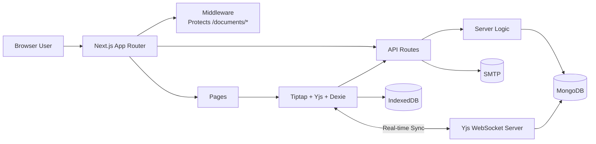
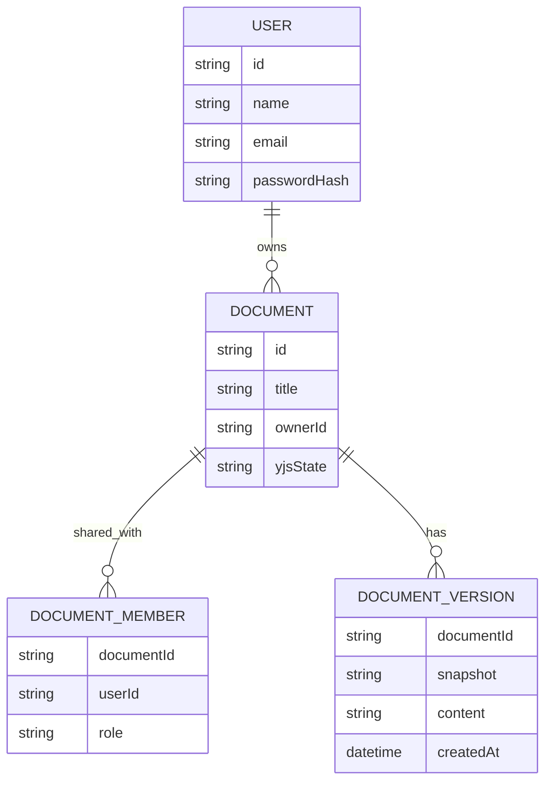

# CoWrite

CoWrite is an offline-first real-time collaborative document editing platform built with Next.js, TypeScript, MongoDB, Tiptap, Yjs, and IndexedDB. It enables multiple users to edit shared documents simultaneously with conflict-free synchronization using CRDT technology. The platform supports role-based document sharing, version history, email invitations, JWT authentication, WebSocket-powered collaboration, and seamless offline editing.

---

## Features

- Real-time collaborative document editing
- Offline-first architecture with automatic synchronization
- Rich text editing using Tiptap
- Conflict-free synchronization using Yjs (CRDT)
- Role-based document sharing (Owner, Editor, Viewer)
- Document version history and restoration
- Email invitations for collaboration using SMTP
- JWT authentication with httpOnly cookies
- WebSocket-powered live collaboration
- IndexedDB (Dexie) local caching
- Automatic background synchronization after reconnecting
- Responsive document dashboard

---

## Tech Stack

| Category | Technology |
|----------|------------|
| Frontend | Next.js 16, React 19, TypeScript |
| Editor | Tiptap |
| Collaboration | Yjs, y-websocket |
| Database | MongoDB, Mongoose |
| Offline Storage | IndexedDB (Dexie) |
| Authentication | JWT, bcryptjs |
| Email | Nodemailer (SMTP) |

---

## Architecture



---

## Project Structure

```text
.
├── middleware.ts
├── next.config.ts
├── package.json
├── scripts/
│   └── collaboration-server.mjs
├── src/
│   ├── app/
│   │   ├── api/
│   │   │   ├── auth/
│   │   │   └── documents/
│   │   ├── documents/
│   │   ├── login/
│   │   ├── register/
│   │   ├── globals.css
│   │   └── layout.tsx
│   ├── components/ui/
│   ├── lib/
│   │   ├── auth.ts
│   │   ├── db.ts
│   │   ├── permissions.ts
│   │   ├── validation.ts
│   │   ├── yjs.ts
│   │   └── client/
│   │       ├── offline-db.ts
│   │       ├── sync-engine.ts
│   │       └── base64.ts
│   └── models/
│       ├── User.ts
│       ├── Document.ts
│       ├── DocumentMember.ts
│       └── DocumentVersion.ts
└── work/
```

---

## Prerequisites

- Node.js 20+
- MongoDB instance
- JWT secret (minimum 32 characters)
- SMTP credentials
- Running Yjs WebSocket server

---

## Environment Variables

Create a `.env.local` file.

```env
MONGODB_URI=mongodb://localhost:27017/collab-docs

JWT_SECRET=replace-with-a-long-random-secret-string

NEXT_PUBLIC_APP_URL=http://localhost:3000

NEXT_PUBLIC_YJS_WS_URL=ws://localhost:1234

YJS_WS_PORT=1234

SMTP_HOST=smtp.example.com
SMTP_PORT=587
SMTP_USER=your-smtp-user
SMTP_PASS=your-smtp-password
```

---

## Installation

Install dependencies.

```bash
npm install
```

Start the Next.js application.

```bash
npm run dev
```

In another terminal, start the collaboration server.

```bash
nodemon collaboration-server.mjs
```

Open:

```
http://localhost:3000
```

---

## Authentication

- Register using name, email, and password.
- Passwords are hashed using bcryptjs.
- Login creates an httpOnly JWT cookie.
- Middleware protects all document routes.
- Unauthenticated users are redirected to the login page.

---

## Document Management

Users can:

- Create new documents
- Rename documents
- Delete owned documents
- View shared documents
- Open documents according to their assigned role

Document content is stored as serialized Yjs state in MongoDB.

---

## Sharing & Permissions

Documents can be shared with registered users.

Supported roles:

- OWNER
- EDITOR
- VIEWER

Owners can invite collaborators by email.

The invitation contains a role-specific document link.

---

## Version History

Owners and editors can:

- Create document snapshots
- View saved versions
- Restore previous versions

Snapshots are stored in MongoDB and mirrored locally for offline access.

---

## Real-Time Collaboration

CoWrite uses Yjs with WebSockets to provide conflict-free collaborative editing.

Features include:

- Simultaneous editing
- Automatic conflict resolution
- Live synchronization
- Incremental updates using Yjs state vectors

---

## Offline Synchronization

CoWrite follows an offline-first architecture.

When the user is offline:

1. Document updates are stored in IndexedDB.
2. Pending changes are queued locally.
3. Editing continues without interruption.
4. Once connectivity returns:
   - Queued Yjs updates are synchronized.
   - Pending versions are uploaded.
   - Local cache is refreshed.

This allows uninterrupted document editing even during network outages.

---

## API Endpoints

### Authentication

```
POST /api/auth/register
POST /api/auth/login
POST /api/auth/logout
GET  /api/auth/me
```

### Documents

```
GET    /api/documents
POST   /api/documents

GET    /api/documents/:id
PATCH  /api/documents/:id
DELETE /api/documents/:id

GET    /api/documents/:id/member
POST   /api/documents/:id/share

POST   /api/documents/:id/sync

GET    /api/documents/:id/version
POST   /api/documents/:id/version
PATCH  /api/documents/:id/version
```

---

## Data Model

- **User**
  - name
  - email
  - passwordHash

- **Document**
  - title
  - ownerId
  - serialized Yjs state

- **DocumentMember**
  - documentId
  - userId
  - userEmail
  - role

- **DocumentVersion**
  - documentId
  - snapshot
  - HTML content
  - creator
  - createdAt

---

## Database Schema



---

## Security

- Password hashing using bcryptjs
- JWT authentication
- httpOnly authentication cookies
- Middleware-protected routes
- Role-based authorization
- Input validation on API routes

---

## Development Notes

- Configure `NEXT_PUBLIC_YJS_WS_URL` to match the running collaboration server.
- SMTP credentials are required for email invitations.
- MongoDB must be available before authenticated routes can be used.
- Offline synchronization depends on IndexedDB (Dexie).

---

## License

No license has been specified for this project.